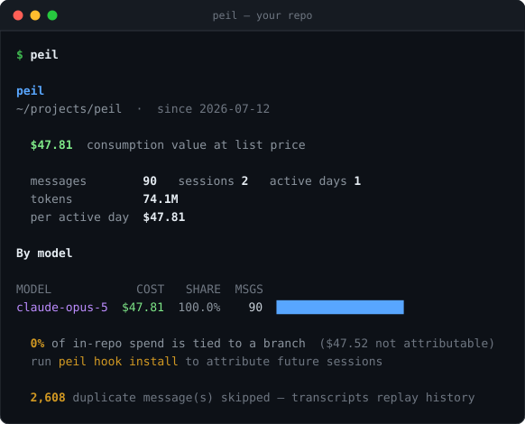
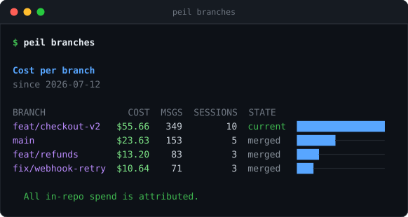
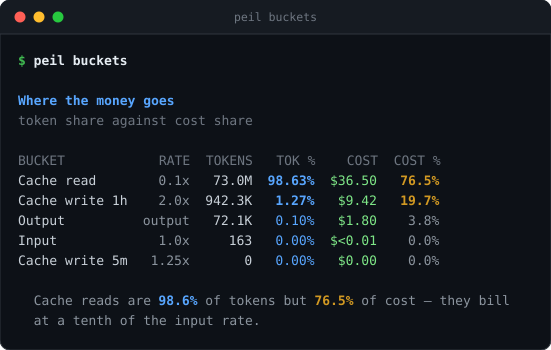
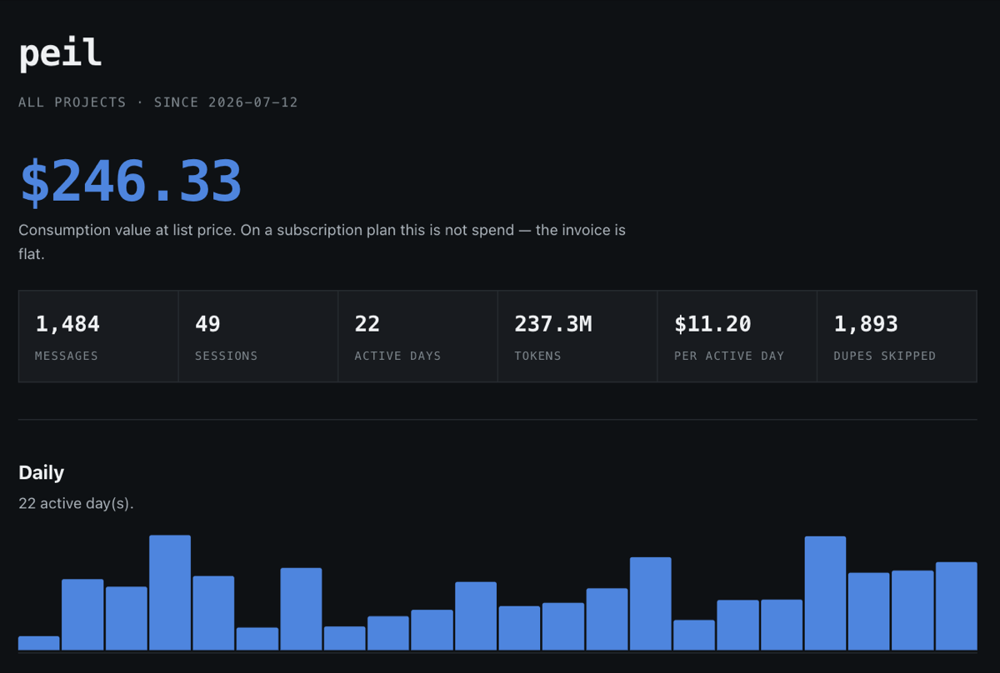

<p align="center">
  
</p>

<h1 align="center">peil</h1>

<p align="center">
  <strong>See what your AI coding sessions actually cost.</strong><br>
  Per repo, per branch, per feature — from transcripts already on your disk.
</p>

<p align="center">
  <a href="https://www.npmjs.com/package/@peil/cli"></a>
  
  <a href="LICENSE"></a>
  
</p>

<p align="center">
  <code>npx @peil/cli</code>
</p>

<p align="center">
  
</p>

That's `peil` run on its own source tree — no flags, no setup, no account.

Two lines there are the whole reason this exists. **90 messages, but 2,608 duplicates skipped:** transcripts replay history, so anything that doesn't deduplicate reports wildly inflated totals. And **0% attributed to a branch**, because that session started a directory above the repo — `peil` tells you the number is incomplete instead of quietly showing you a smaller one as if it were the whole picture.

## Try it

```sh
cd your-project
npx @peil/cli
```

That's the whole quick start. Nothing to configure, nothing to sign up for. If you want to keep it around:

```sh
npm i -g @peil/cli   # then just: peil
```

Requires Node 20+. (`peil hook install` additionally needs `jq`.)

## What you get

### What did that feature cost?

```sh
peil branches
```



Cost per branch, with what couldn't be attributed called out rather than hidden. Run `peil hook install` once and every future session records its real branch.

### Where the money actually goes

```sh
peil buckets
```



Token counts and cost are not the same shape. Cache reads are almost all your tokens and a fraction of your bill; 1-hour cache writes are the reverse. `peil buckets` puts the two shares side by side — see [why the numbers differ](#why-the-numbers-differ-from-other-tools) for the arithmetic.

### A report you can send someone

```sh
peil report          # writes peil-report.html
```



One self-contained HTML file — no assets, no scripts, no network. Open it, attach it, drop it in a wiki.

<sub><i>The branch and report images use a generated sample dataset, so no real project names appear. The first screenshot is a genuine run.</i></sub>

## Commands

| Command | What it does |
|---|---|
| `peil` | Summary for the current repository |
| `peil branches` | Cost per branch, and what couldn't be attributed |
| `peil buckets` | Token share against cost share |
| `peil report` | Standalone HTML report |
| `peil hook install` | Record the real git branch on future sessions |
| `peil hook status` | Is branch recording working? |

| Option | What it does |
|---|---|
| `--days <n>` | Look back n days (default 30) |
| `--since <date>` | Look back to an ISO date, overrides `--days` |
| `--all` | Every project, not just this one |
| `--out <file>` | Output path for `report` |
| `--json` | Machine-readable output |

## Why the numbers differ from other tools

A Claude Code message doesn't have "an input token count". It has four separately-priced input buckets, and pricing them as one number is wrong by a large multiple.

| Bucket | Rate | Typical share of tokens |
|---|---|---|
| `input` | 1.00× input | ~0.02% |
| `cache_read` | **0.10×** input | **~97%** |
| `cache_write` 5m | 1.25× input | small |
| `cache_write` 1h | **2.00×** input | ~2% |
| `output` | output rate | ~0.4% |

Two mistakes are easy, and both are large:

1. **Pricing every input-side token at the full input rate.** Cache reads are routinely 97% of all tokens, so this overstates cost by roughly **6×**.
2. **Using the flat `cache_creation_input_tokens` field at 1.25×.** Most cache writes carry the 1-hour TTL and bill at **2×**. Read the nested `cache_creation` object instead.

`peil buckets` shows the split. On a real 90-day sample: cache reads were 97.8% of tokens but 63.2% of cost, while 1-hour cache writes were 1.8% of tokens and 23.4% of cost.

**It also deduplicates on `message.id`.** Roughly half of usage-bearing transcript lines are replays — resumed sessions, forks and streaming reconstruction all write the same assistant message more than once. Not deduping doubles every figure.

Rate cards are **dated**, so re-running a report over a past period keeps producing the same answer after a price change.

## Branch attribution

`peil branches` answers *what did that feature cost*.

Claude Code writes a `gitBranch` field, but resolves it **once, from the directory the session started in**, and never re-evaluates it. Three different situations wear the same value:

- `main` — a real branch, trustworthy
- `HEAD` — the session started outside a repository, so there is no branch. Correct, but not a branch name
- `null` — nothing recorded

So **starting Claude Code from the repository root is what makes the field useful.** Changing directory later doesn't help.

`peil hook install` adds a `SessionStart` hook that records the branch independently. It uses `git symbolic-ref` rather than `rev-parse --abbrev-ref`, because the latter returns the literal `HEAD` when detached — collapsing "detached" and "no branch" into one ambiguous string. The hook keeps three states distinct: a branch name, `detached:<sha>`, and `null`.

It appends one line per session to `~/.claude/branch-log.jsonl`:

```json
{"ts":"2026-08-11T10:26:12Z","session_id":"e722e84b","cwd":"/Users/me/projects/app","repo":"/Users/me/projects/app","branch":"feat/checkout"}
```

Session id, working directory, repository root, branch. Nothing else. Local file, never uploaded.

## Privacy

`peil` runs entirely on your machine. **No account, no upload, no network calls of any kind, no telemetry.**

It reads `~/.claude/projects/**/*.jsonl` and takes only scalar fields: model, token counts, timestamps, session id, working directory, branch, CLI version and tool names.

It never reads `message.content` — not prompts, not responses, not file contents, not tool inputs or results.

The source is short and MIT-licensed; [`src/transcripts.ts`](src/transcripts.ts) is the only file that touches your transcripts, and it's worth the two minutes to read.

## A note on "cost"

Figures are **list price**. If you're on a Claude subscription the invoice is flat, so these numbers are *consumption value*, not spend — useful for "are we getting the seat's worth" and for comparing features against each other, not for reconciling a bill. On API billing they approximate actual spend, though your organisation's negotiated rates may differ.

## Licence

MIT
